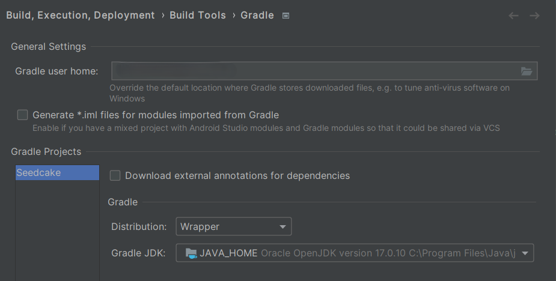
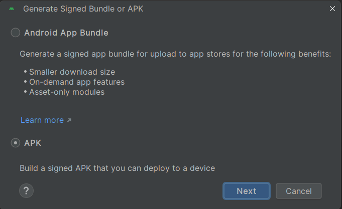
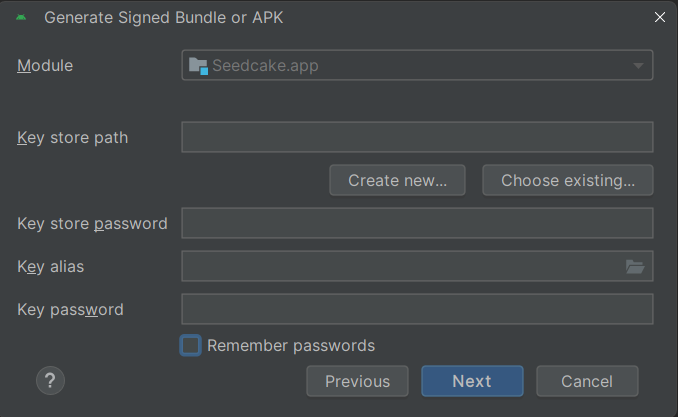
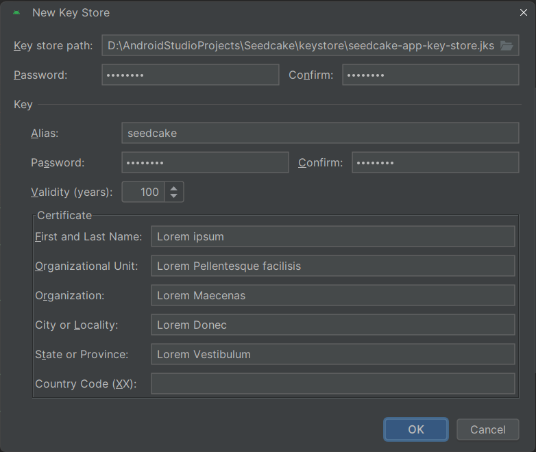
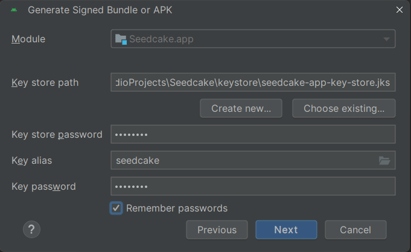
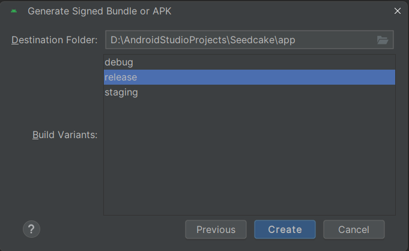
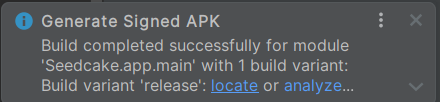
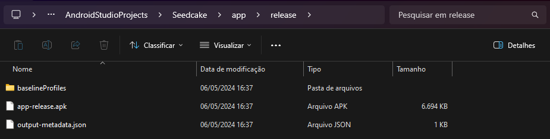

# Guide to Create a Release Build in Android Studio

This guide outlines how to generate a release build of Sedcake using the Android Studio interface.

## Prerequisites

- **Android Studio** — Assuming you already have Android Studio installed, we recommend using Android Studio Iguana | 2023.2.1 Patch 2, Build #AI-232.10300.40.2321.11668458, built on April 3, 2024. This will ensure compatibility with the project settings and features used in Sedcake.
- **JDK 17** — Ensure that JDK 17 is installed and configured, as the project is compiled with this version.

## Steps to Create a Release Build

### Step 1: Configure the Keystore

1. **Open Build Settings:**
   - In Android Studio, go to `Build > Generate Signed Bundle / APK...`.
   

2. **Create a Keystore:**
   - Select the `APK` option and click `Next`.
   

   - Click on `Create new...` to start creating a new keystore.
   

   - Fill in the required details such as Alias, Keystore Password, Key Password, and personal certificate information.
   

   - Click `OK` to save the keystore.

### Step 2: Configure and Generate the Release Build

3. **Select the Keystore:**
   - Choose the keystore you created, entering the Alias and Passwords accordingly.
   

4. **Choose Build Type and Configure Options:**
   - Select `release` as the build type and confirm the settings.
   - Click `Next` and then `Create`.
   

### Step 3: Locate the Generated APK

5. **Build Completion:**
   - A notification will indicate that the build was successfully completed. Click `locate` to open the folder where the APK was saved.
   

   - You will find the APK in the specified folder.
   

## Conclusion

Following these steps, you will have generated a signed APK of your project, ready for distribution or installation on devices. This process ensures that you have full control over the creation of builds for your application, which is important for applications dealing with sensitive information.
