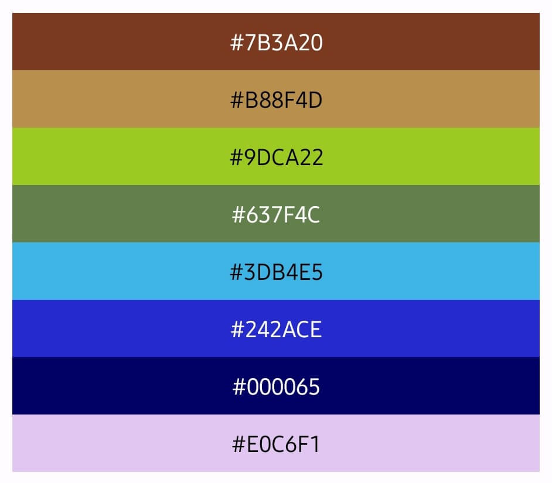
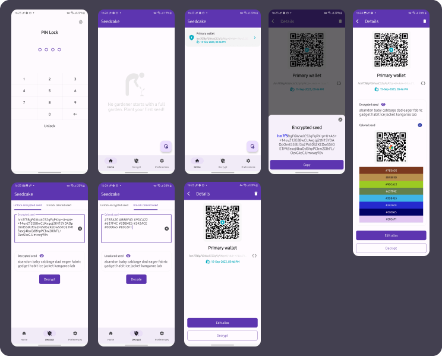
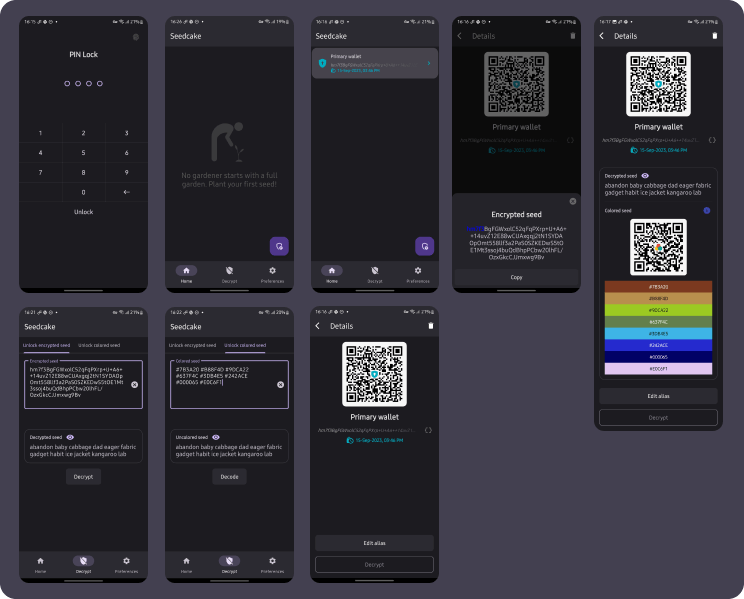

# Self-Custody in a Digital and Physical World 🌍

## Introduction 📖

Welcome to <strong>Seedcake</strong> 🌱🍰, a secure and open-source solution for storing your Bitcoin seed phrases based on Bip-39. This project was born out of the need for a flexible yet secure alternative in scenarios where conventional physical storage methods like crypto steel 🤘, paper 🧻 etc... are impractical or risky.
 

## The Sacred Place of Self-Custody 🛡️

There's no doubt that self-custody is more than just a buzzword in the world of cryptocurrencies; it's a philosophy and, for many, a way of life. The security that comes with the physical storage of your seed phrases is unmatched. The cold touch of crypto steel can represent more than just material; it is the tangibility of your financial autonomy.

## Alternative When Physical Method Becomes Unviable 🌪️

Seedcake doesn't aim to invalidate the use of physical storage methods for your seed phrases; on the contrary, the project is yet another solution that can be used in scenarios where carrying crypto steel or paper isn't convenient.

Physical storage methods, like crypto steel, are not only secure but true strongholds against the complexities and vulnerabilities of the digital world. This is your most robust shield against digital intruders, an almost impenetrable barrier that stands firm even as cyber attack technology advances.

However, the sturdiness of physical storage can also be its biggest drawback.
- Imagine having to flee from an authoritarian country. Would you really trust a piece of crypto steel that could be confiscated at the border?
- Now think about an armed conflict that would leave your home in ruins, and your seed phrases would now be under tons of rubble.
- Or even in an unfortunate natural disaster scenario where your crypto steel would simply become inaccessible.

These are not movie scenarios; they are realities for many people today. These are just some of the circumstances where the physical approach to storing your seed phrases becomes impractical, and this is where the advantages of the digital world come into play and become a necessary addition to your self-custody arsenal.

A strong argument in favor of encryption is that it's the backbone of the entire cryptocurrency ecosystem. If you're comfortable with the idea of entrusting your digital assets to encryption algorithms, it seems logical that these algorithms can also be trusted to securely store your recovery phrases.

## The Symbiosis of Security 🔄

The true effectiveness in self-custody in an uncertain world isn't a matter of "either this or that"; it's a balance of both. Optimal security is achieved through the symbiosis between physical and digital storage methods. Seedcake offers this flexibility, allowing you to face a range of both tangible and intangible threats with equal efficacy.
  
---
## Seedcake Features 🌟

Seedcake is designed with trust as its core. Being an open-source project, it allows for audits, ensuring that the code can be examined to confirm its safety and reliability, and is open for contributions for improvements.

#### Encryption Algorithm: AES/CBC/PKCS5Padding

The AES (Advanced Encryption Standard) algorithm is a standard choice for symmetric cipher operations and is recognized for its robustness and performance. In CBC mode (Cipher Block Chaining), each block of plaintext is XORed with the previous ciphertext block before being encrypted, enhancing security. PKCS5Padding is used to pad the blocks, ensuring the data fits perfectly into the block size.

#### Key Derivation Algorithm: PBKDF2 with HmacSHA256

PBKDF2 (Password-Based Key Derivation Function 2) is a standard algorithm for deriving secure keys from a password. We use the SHA-256 hash algorithm in conjunction with HMAC to provide an additional layer of security. This approach makes brute-force or rainbow table attacks much more difficult.

#### Key Size: 256 bits

The symmetric key used for encryption and decryption is 256 bits in size. This is the maximum key size for AES and is considered secure for most current applications.

#### Number of Key Derivation Iterations: 65,536

The entered password undergoes 65,536 iterations of the PBKDF2 key derivation algorithm. This is done to add a "computational cost" factor to the process, making brute-force attacks significantly more time-consuming and, therefore, impractical.

#### Initialization Vector (IV) Size: 16 bytes

A 16-byte Initialization Vector (IV) is randomly generated for each new encryption operation. Using a different IV for each encryption is crucial to ensure that the same plaintext is not encrypted to the same ciphertext in different runs.

### Requirements for Seed Phrase and Passphrase

#### Seed Phrase 🌱

The seed phrase should consist of a specific number of words: 12 or 24, which are the most commonly used settings. Also, all the words must be part of the standard Bip-39 word list in English. This ensures that no phrase not existing on the Bip-39 list is accidentally entered.

### Encryption Example 🔒

A seed like:  
`abandon banana captain dancer eagle fabric galaxy habitat ice jacket kangaroo lantern`

Would have this type of encrypted seed `ctRNV3s5qm7v1D4LM2otDKcgpwemLSJJrRye5thXfymgxjQ6RHEoW8XNpAzXrZDKIb49NqP+5ZcgjujuoFxRNPh/WsCACU91zC1+3VI6L8tt9qPZgKm8omiazyI5XuXe`

### Decryption Features 🛠️

When you need to recover your seed, Seedcake not only decrypts the seed phrase but offers an innovative approach for discreet use **Colored Seed**.

#### Colored Seed 🌈

This feature was written in Kotlin based on the project repository [BIP39 Colors](https://github.com/enteropositivo/bip39colors) created by [@EnteroPositivo](https://twitter.com/EnteroPositivo) under the [CC By](https://github.com/EnteroPositivo/bip39Colors/blob/main/LICENSE.md) license, which assigns a unique color palette to your seed phrase, providing a less secure, alternative method to store or even memorize your seed.

A seed like:  
`abandon banana captain dancer eagle fabric galaxy habitat ice jacket kangaroo lantern`

Would have this kind of colored seed  
`#7B3A20 #B88F4D #9DCA22 #637F4C #3DB4E5 #242ACE #000065 #E0C6F1`

### Light and Dark Theme App Screenshots 🎨

## Disclaimer 🛑

By using Seedcake, you acknowledge that you are fully responsible for the security of your assets and information. We do not store any passwords or passphrases locally or remotely, and as such, we cannot assist in password or asset recovery.

Please be aware that Seedcake is designed to be a tool in your self-custody strategy, but using it comes with risks. You are responsible for safeguarding your `PIN Lock`, `passphrases`, and other sensitive information. Always exercise caution and make informed decisions.
