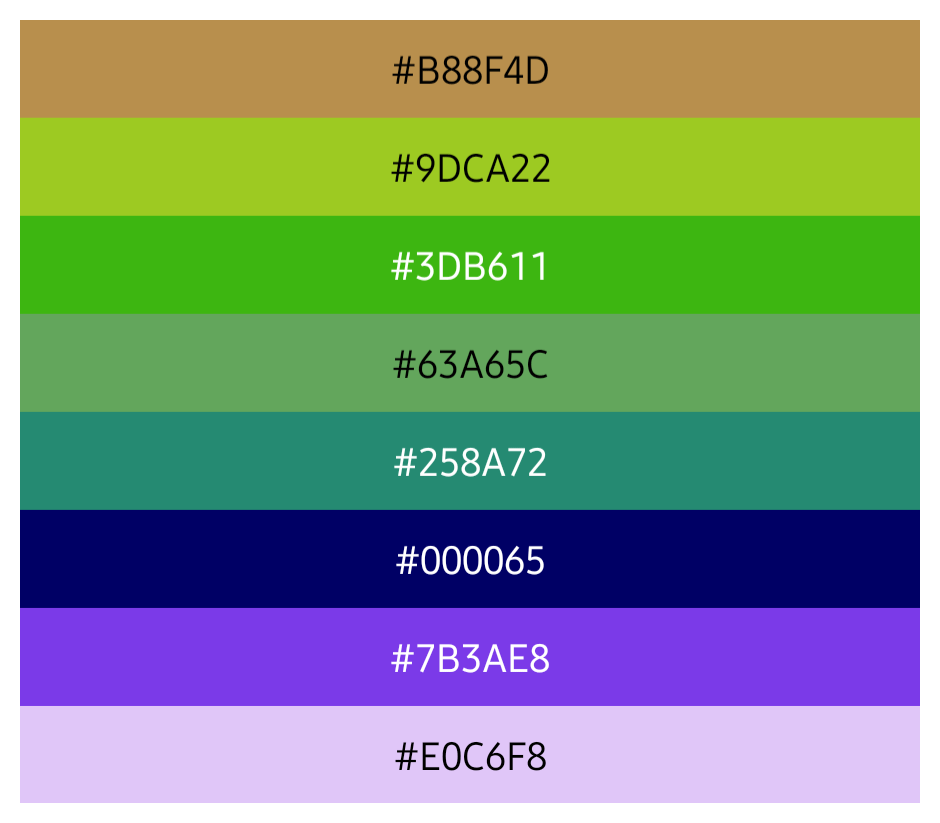
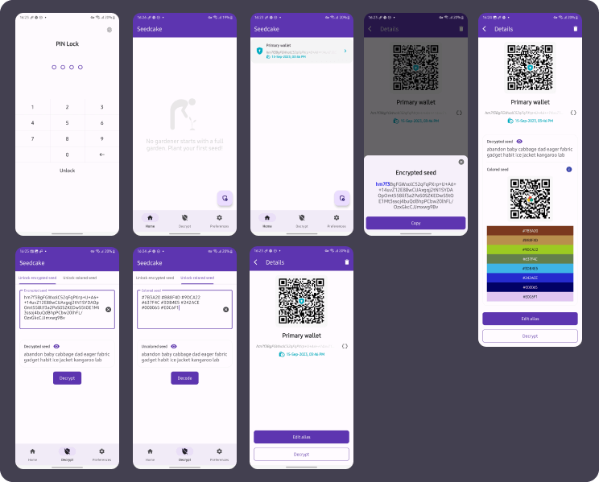
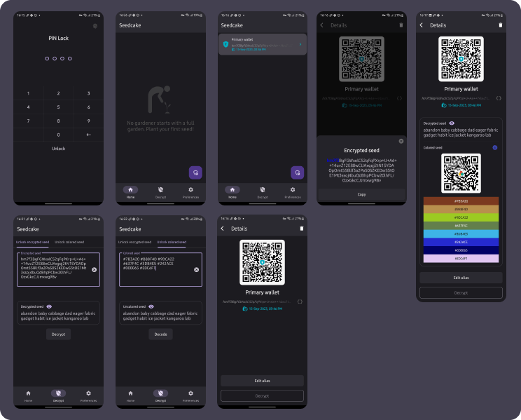

# Self-Custody in a Digital and Physical World 🌍

### Introduction 📖

Welcome to <strong>Seedcake</strong> 🌱🍰, a secure and open-source solution for storing your Bitcoin seed phrases based on Bip-39. This project was born out of the need for a flexible yet secure alternative in scenarios where conventional physical storage methods like crypto steel 🤘, paper 🧻 etc... are impractical or risky.
 

## Download the Latest Release 📥

**OR**

For the latest stable version of Sedcake, visit our [Releases page](https://github.com/F4bioo/Seedcake/releases) and download the APK directly.

## Build Instructions 🛠️

For a step-by-step guide on building Sedcake from source, please see the [BUILD.md](BUILD.md) guide.

---

## The Sacred Place of Self-Custody 🛡️

There's no doubt that self-custody is more than just a buzzword in the world of cryptocurrencies; it's a philosophy and, for many, a way of life. The security that comes with the physical storage of your seed phrases is unmatched. The cold touch of crypto steel can represent more than just material; it is the tangibility of your financial autonomy.

## Alternative When Physical Method Becomes Unviable 🌪️

Seedcake doesn't aim to invalidate the use of physical storage methods for your seed phrases; on the contrary, the project is yet another solution that can be used in scenarios where carrying crypto steel or paper isn't convenient.

Physical storage methods, like crypto steel, are not only secure but true strongholds against the complexities and vulnerabilities of the digital world. This is your most robust shield against digital intruders, an almost impenetrable barrier that stands firm even as cyber attack technology advances.

However, the sturdiness of physical storage can also be its biggest drawback.
- Imagine having to flee from an authoritarian country. Would you really trust a piece of crypto steel that could be confiscated at the border?
- Now think about an armed conflict that would leave your home in ruins, and your seed phrases would now be under tons of rubble.
- Or even in an unfortunate natural disaster scenario where your crypto steel would simply become inaccessible.

These are not movie scenarios; they are realities for many people today. These are just some of the circumstances where the physical approach to storing your seed phrases becomes impractical, and this is where the advantages of the digital world come into play and become a necessary addition to your self-custody arsenal.

A strong argument in favor of encryption is that it's the backbone of the entire cryptocurrency ecosystem. If you're comfortable with the idea of entrusting your digital assets to encryption algorithms, it seems logical that these algorithms can also be trusted to securely store your recovery phrases.

## The Symbiosis of Security 🔄

The true effectiveness in self-custody in an uncertain world isn't a matter of "either this or that"; it's a balance of both. Optimal security is achieved through the symbiosis between physical and digital storage methods. Seedcake offers this flexibility, allowing you to face a range of both tangible and intangible threats with equal efficacy.
  
---
## Seedcake Features 🌟

Seedcake is designed with trust as its core. Being an open-source project, it allows for audits, ensuring that the code can be examined to confirm its safety and reliability, and is open for contributions for improvements.

### How It Works: A Simplified Overview

#### Encryption Algorithm

We use a secure, standard encryption method (AES/GCM) to keep your data safe. It's like a secure lockbox for your information.

#### Key Derivation

Your password goes through a process that makes it even stronger. This adds an extra layer of security, making it hard for anyone to break in.

#### Key Size

We use a strong, 256-bit key for the encryption. Think of it like a really complicated key that's hard to duplicate.

#### Number of Iterations

Your password is processed multiple times (200,000 iterations) to make it even more secure. This makes it time-consuming for anyone trying to guess your password.

#### IV and Salt Size

We also use random data to make the encryption unique every time. This ensures that even if you encrypt the same data twice, it will look different each time.

### Requirements for Seed Phrase and Passphrase

#### Seed Phrase 🌱

The seed phrase should consist of a specific number of words: 12 or 24, which are the most commonly used settings. Also, all the words must be part of the standard Bip-39 word list in English. This ensures that no phrase not existing on the Bip-39 list is accidentally entered.

### Encryption Example 🔒

A seed like:
`abandon banana captain dance eagle fabric galaxy habit ice jacket kangaroo language`

Would have this type of encrypted seed:
`a5qjuKiSIR49DL0WeD1caGA6jbIufP/G82hIYpV5b5Evtjj1QNZwsMKGRM6SRgzh8IYlYVHfDVyBAyuXvCsFsGKuksr8a/7bf9zPwikG7d51Ygtq/wb3L2OHq2mjznO7RTjTf+/aaG7Y/8xLegSwUnaWHRj+Ut9w1Pv/FaiN1A==:ENDeyJjcyI6IkdDTSIsImlzIjoxMiwia2EiOiJBRVMiLCJrYiI6MjU2LCJrZCI6IlBIUzUxMiIsImtpIjoyMDAwMDAsInNzIjoxNn0=`

#### Breaking It Down

- The first part (before `:END`) is your encrypted seed. It's the locked-up version of your seed phrase.  
  `a5qjuKiSIR49DL0WeD1ca...Rj+Ut9w1Pv/FaiN1A==`

- The second part (after `:END`) is what we call metadata. It's like the instruction manual for unlocking the seed, but it's not actually part of the seed itself.  
  `:ENDeyJjcyI6IkdDTSIs...MDAwMDAsInNzIjoxNn0=`

The second part appears less visible to indicate that it's not the seed, but it's essential for decrypting it.

### Decryption Features 🛠️

When you need to recover your seed, Seedcake not only decrypts the seed phrase but offers an innovative approach for discreet use **Colored Seed**.

#### Colored Seed 🌈

This feature was written in Kotlin based on the project repository [BIP39 Colors](https://github.com/enteropositivo/bip39colors) created by [@EnteroPositivo](https://twitter.com/EnteroPositivo) under the [CC By](https://github.com/EnteroPositivo/bip39Colors/blob/main/LICENSE.md) license, which assigns a unique color palette to your seed phrase, providing a less secure, alternative method to store or even memorize your seed.

A seed like:
`abandon banana captain dance eagle fabric galaxy habit ice jacket kangaroo language`

Would have this kind of colored seed:
`#B88F4D #9DCA22 #3DB611 #63A65C #258A72 #000065 #7B3AE8 #E0C6F8`

### Light and Dark Theme App Screenshots 🎨

## Disclaimer 🛑

By using Seedcake, you acknowledge that you are fully responsible for the security of your assets and information. We do not store any passwords or passphrases locally or remotely, and as such, we cannot assist in password or asset recovery.

Please be aware that Seedcake is designed to be a tool in your self-custody strategy, but using it comes with risks. You are responsible for safeguarding your `PIN Lock`, `passphrases`, and other sensitive information. Always exercise caution and make informed decisions.
